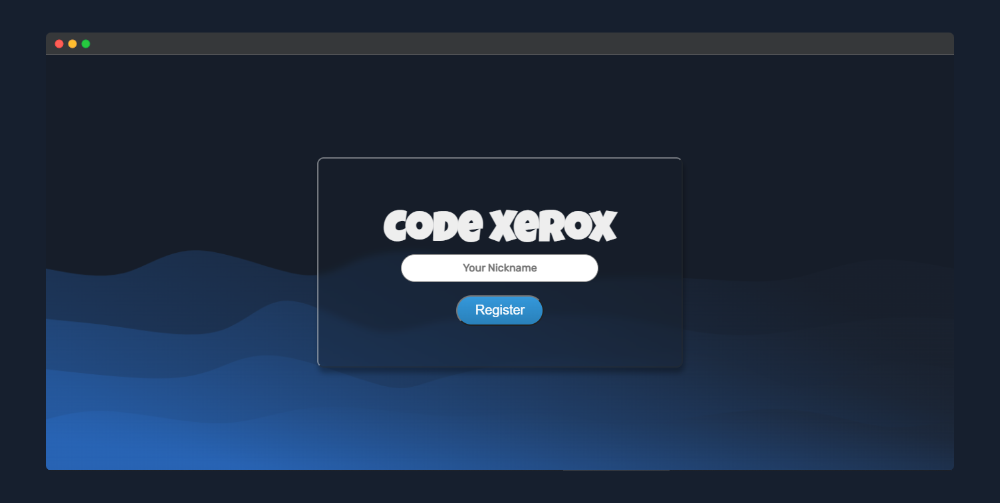
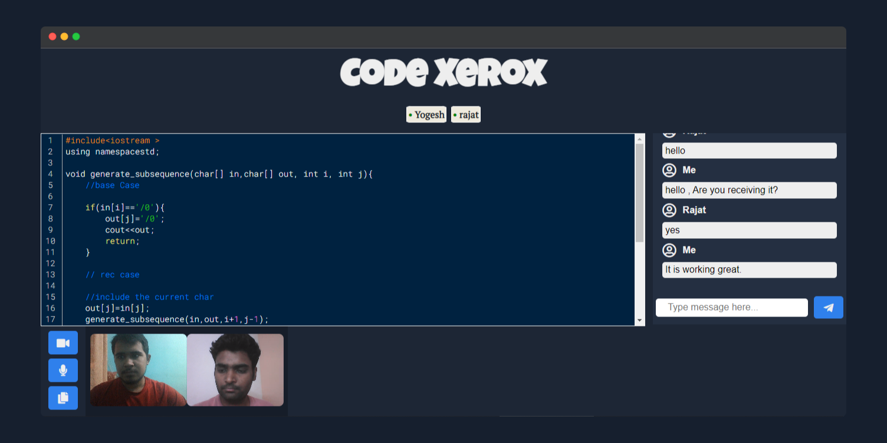

<div id="top"></div>

<!-- PROJECT LOGO -->
<br />
<div align="center">
  <a href="https://github.com/rajatagarwal768/Code-Xerox/">
    
  </a>

  <h1 align="center">Code Xerox</h1>

  <p align="left">
   A collaborative code editor with live code sharing and video calling. Try out with this given <a href="https://rajat768-code-xerox.herokuapp.com/">Project link</a>.
  </p>
</div>


<!-- TABLE OF CONTENTS -->
<details>
  <summary>Table of Contents</summary>
  <ol>
    <li>
      <a href="#about-the-project">About The Project</a>
      <ul>
        <li><a href="#Main-feature-of-the-code-xerox-are-as-follows">Features of this project</a></li>
        <li><a href="#built-with">Built With</a></li>
      </ul>
    </li>
    <li>
      <a href="#getting-started">Getting Started</a>
      <ul>
        <li><a href="#prerequisites">Prerequisites</a></li>
        <li><a href="#installation">Installation</a></li>
      </ul>
    </li>
    <li><a href="#usage">Usage</a></li>
    <li><a href="#contributing">Contributing</a></li>
    <li><a href="#contact">Contact</a></li>
    <li><a href="#Vote-of-Thanks">Vote of thanks</a></li>
  </ol>
</details>


<!-- ABOUT THE PROJECT -->
## About The Project

When a text editor is outfitted with collaborative editing capabilities, and real time conversation it can be a show stopper. There are a number of applications available that excel at offering such functionality.
I wanted to design and build a system that could handle simple text editing along with communication and collaboration. Using the Code Xerox, several users may collaborate on documents in real time. The current editing stances of other users are always visible via Remote-Cursors.


## Main feature of the code xerox are as follows
* Multiple users can edit code in real time. :revolving_hearts:
* You can communicate in real time via video and audio call :phone:
* Syntax highlighting is present currently supporting C-like languages. :smile:
* You can create as many rooms as you want [but currently have a scalibility issues] :hugs:
* You can also chat in chat window :speech_balloon:

<p align="right">(<a href="#top">back to top</a>)</p>


### Built With

Major frameworks/libraries used to bootstrap your project.

1) HTML
2) CSS 
3) JavaScript
4) NodeJs
5) Expressjs
6) Socket.io
7) Peerjs
8) Uuid

<p align="right">(<a href="#top">back to top</a>)</p>


<!-- GETTING STARTED -->
## Getting Started

Follow thses steps to run the code on your local host.
To get a local copy up and running follow these simple example steps.

### Prerequisites

This is an example of how to list things you need to use the software and how to install them.
* npm
  ```sh
  npm install npm@latest -g
  ```

### Installation

1. Clone the repo
   ```sh
   gh repo clone rajatagarwal768/Code-Xerox
   ```
2. Install NPM packages
   ```sh
   npm install
   ```
4. Open the terminal in the root folder and run the command 
   ```sh
   npm run dev
   ```

#### Open in the http://localhost:3000 to open the instance of the app and copy the link in the other tab and see the magic. 
<p align="right">(<a href="#top">back to top</a>)</p>


<!-- USAGE EXAMPLES -->
## Usage






### You can also use the given hosted link to talk with your friend [ If it does not work try multiple time because it has scalibility and ping issues. I promise it will work :crossed_fingers: ]

<p align="right">(<a href="#top">back to top</a>)</p>


<!-- CONTRIBUTING -->
## Contributing
 Any contributions you make are **greatly appreciated**.

If you have a suggestion that would make this better, please fork the repo and create a pull request. You can also simply open an issue with the tag "enhancement".
Don't forget to give the project a star! Thanks again!

1. Fork the Project
2. Create your Feature Branch (`git checkout -b feature/AmazingFeature`)
3. Commit your Changes (`git commit -m 'Add some AmazingFeature'`)
4. Push to the Branch (`git push origin feature/AmazingFeature`)
5. Open a Pull Request

<p align="right">(<a href="#top">back to top</a>)</p>


<!-- CONTACT -->
## Contact

Rajat Agarwal - [LinkedIn - Rajat Agarwal](https://www.linkedin.com/in/rajat768/) - rajatagarwal768@gmail.com


<p align="right">(<a href="#top">back to top</a>)</p>


## Vote of Thanks
- Thanks to [Yogesh Shahi](https://www.linkedin.com/in/yogesh-shahi/) for Equally contributing to the code and completing the project.
